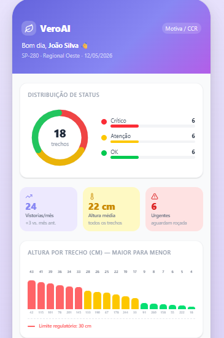
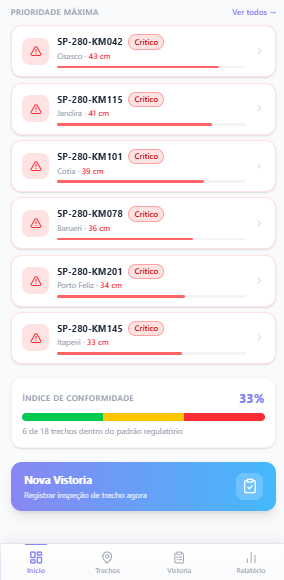
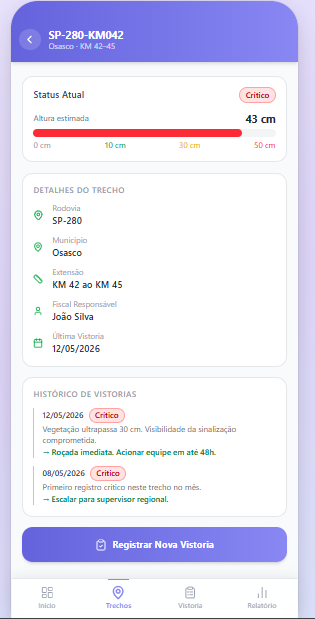
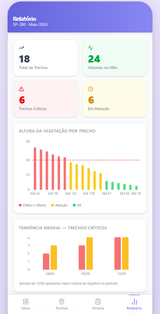
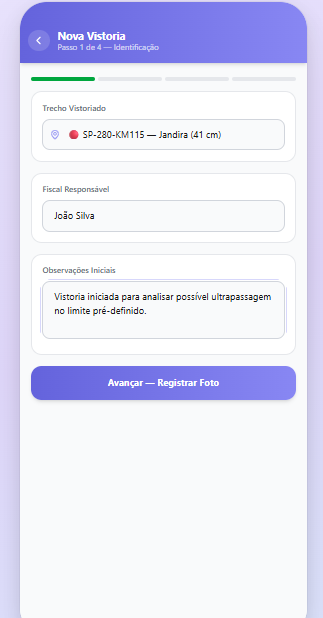
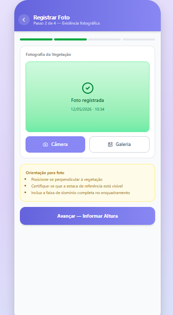
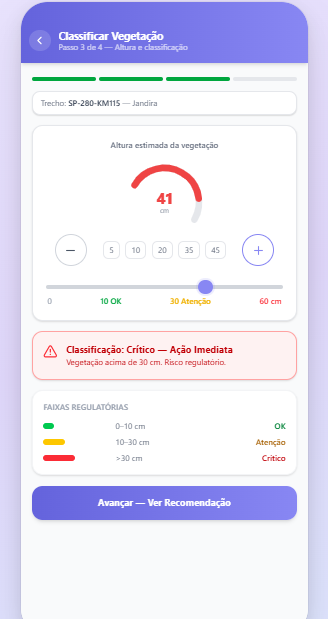
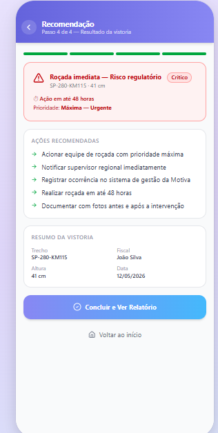
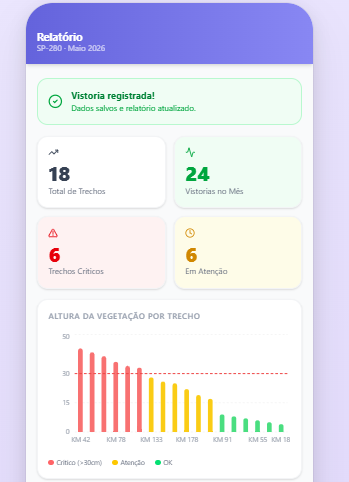

# VeroAI — Monitoramento Inteligente de Vegetação em Rodovias

> **Challenge CCR Motiva · Sprint 1 — Exploração, Requisitos e Protótipo**

---

## Descrição do Problema

A Motiva/CCR enfrenta desafios significativos no monitoramento da vegetação ao longo das rodovias concedidas. O processo atual depende de inspeções visuais manuais, planilhas descentralizadas, cronogramas fixos e avaliações subjetivas dos fiscais de campo. Esse modelo gera falta de padronização nos registros, risco de cortes desnecessários ou tardios, atrasos em intervenções preventivas e exposição a multas regulatórias quando a vegetação ultrapassa o limite de 30 cm estabelecido pelas normas vigentes.

---

## Integrantes

| Nome | RM |
|------|----|
| *(André Nobrega)* | *(RM561754)* |
| *(André Gouveia)* | *(RM564219)* |
| *(Caio Carminato)* | *(RM563630)* |
| *(Guilherme Tamai)* | *(RM563276)* |
| *(Mirella Mascarenhas)* | *(RM562092)* |
| *(Vitor Komura)* | *(RM563694)* |

---

## Persona Detalhada

**Nome fictício:** João Silva

**Cargo:** Fiscal de Conservação Rodoviária

**Empresa:** Motiva (concessionária CCR)

**Regional:** Regional Oeste — SP-280

**Experiência:** 8 anos no setor rodoviário


**Perfil comportamental:**

- Realiza entre 3 e 6 inspeções de campo por dia, percorrendo trechos de rodovia a pé ou de veículo

- Trabalha em ambientes com conectividade instável, exposição a sol, chuva e poeira

- Não possui familiaridade com ferramentas tecnológicas complexas

- Valoriza respostas rápidas, interfaces diretas e pouca digitação

- Precisa registrar evidências fotográficas para respaldo em eventuais auditorias


**Dores principais:**

- Preenchimento manual de planilhas após cada vistoria

- Ausência de critério padronizado para classificar o risco da vegetação conforme exigência ARTESP

- Dificuldade em priorizar qual trecho precisa de intervenção urgente

- Risco de multa quando vegetação supera 30 cm sem registro formal da ocorrência


**Expectativas com a solução:**

- Registrar uma vistoria completa em menos de 2 minutos

- Saber imediatamente se o trecho está dentro ou fora do padrão regulatório

- Ter evidência fotográfica vinculada ao registro para fins de auditoria

- Receber recomendação automática de ação com prazo definido

---

## Proposta de Solução

O **VeroAI** é um aplicativo mobile para apoio ao monitoramento inteligente da vegetação em rodovias. O app permite que fiscais registrem vistorias por trecho, capturem e enviem fotos da vegetação com referência de estaca, insiram a altura estimada e recebam, automaticamente, a classificação de risco e a recomendação de ação correspondente.

### Faixas de Classificação

| Altura | Classificação | Ação |
|--------|---------------|------|
| até 10 cm | OK | Monitoramento regular |
| 10 cm a 30 cm | Atenção | Roçada preventiva em 15 dias |
| acima de 30 cm | Crítico | Roçada imediata (risco regulatório) |

---

## Stack Tecnológica

| Tecnologia | Versão | Papel |
|------------|--------|-------|
| Next.js | 16 | Framework principal (App Router) |
| React | 19 | Interface de usuário |
| TypeScript | 5 | Tipagem estática |
| Tailwind CSS | 4 | Estilização utility-first |
| Lucide React | latest | Ícones |
| Vercel | — | Hospedagem e deploy contínuo |

### Justificativa Técnica

O Next.js com App Router foi escolhido pela facilidade de roteamento declarativo, SSG nativo e deploy zero-config na Vercel. O Tailwind CSS viabiliza desenvolvimento ágil de UI mobile-first sem overhead de CSS customizado. TypeScript garante segurança de tipos desde o protótipo, reduzindo retrabalho nas Sprints seguintes. A Vercel foi escolhida como plataforma de hospedagem pela integração direta com repositórios GitHub, previews automáticos e latência otimizada para o Brasil.

---

## Funcionalidades Principais 

- [x] Tela de login com autenticação simulada (matrícula + senha)
- [x] Dashboard com resumo de trechos críticos e acesso rápido
- [x] Lista de trechos monitorados ordenados por prioridade
- [x] Detalhe do trecho com histórico de vistorias
- [x] Fluxo completo de nova vistoria (4 passos)
  - [x] Identificação do trecho e fiscal
  - [x] Registro fotográfico simulado
  - [x] Inserção de altura e classificação automática
  - [x] Geração de recomendação de ação
- [x] Relatório consolidado com índice de conformidade
- [x] Navegação por bottom navigation bar
- [x] Layout mobile-first (max-width 430px)

---

## Requisitos Funcionais (RF)


| ID | Descrição | Prioridade |

|----|-----------|------------|

| RF01 | O sistema deve permitir o login do fiscal com matrícula e senha | Alta |

| RF02 | O sistema deve exibir um dashboard com resumo dos trechos por status de conformidade | Alta |

| RF03 | O sistema deve listar todos os trechos monitorados com status, altura e data da última vistoria | Alta |

| RF04 | O sistema deve agrupar os trechos por dia da semana da última vistoria | Média |

| RF05 | O sistema deve exibir os detalhes de cada trecho, incluindo histórico de vistorias | Alta |

| RF06 | O sistema deve permitir iniciar uma nova vistoria vinculada a um trecho específico | Alta |

| RF07 | O sistema deve permitir o registro ou simulação de fotografia da vegetação como evidência | Alta |

| RF08 | O sistema deve permitir ao fiscal informar a altura estimada da vegetação | Alta |

| RF09 | O sistema deve classificar automaticamente a vegetação em OK, Atenção ou Crítico com base nos limites regulatórios ARTESP/ANTT | Alta |

| RF10 | O sistema deve gerar uma recomendação de ação com prazo com base na classificação | Alta |

| RF11 | O sistema deve exibir um relatório consolidado com gráficos de altura por trecho e tendência mensal | Média |

| RF12 | O sistema deve exibir o índice de conformidade regulatória dos trechos | Média |

| RF13 | O sistema deve exibir alertas visuais destacados para trechos com status Crítico | Média |

| RF14 | O sistema deve registrar data, hora e fiscal responsável em cada vistoria | Alta |

| RF15 | O sistema deve ordenar trechos e alertas pela maior criticidade (maior altura primeiro) | Alta |


---

## Requisitos Não Funcionais (RNF)


| ID | Descrição | Categoria |

|----|-----------|-----------|

| RNF01 | A interface deve ser mobile-first, com largura máxima de 430px, adaptada ao uso em campo | Usabilidade |

| RNF02 | O tempo de carregamento de cada tela deve ser inferior a 2 segundos | Performance |

| RNF03 | A aplicação deve funcionar nos navegadores Chrome e Safari mobile | Compatibilidade |

| RNF04 | O sistema deve ser responsivo para diferentes tamanhos de tela mobile | Usabilidade |

| RNF05 | Os dados devem ser simulados localmente (mock) na Sprint 1, sem necessidade de backend real | Arquitetura |

| RNF06 | O código deve ser escrito em TypeScript com tipagem explícita para facilitar manutenção | Manutenibilidade |

| RNF07 | O deploy deve ser realizado na Vercel com CI/CD automático via GitHub | Infraestrutura |

| RNF08 | A aplicação não deve armazenar dados sensíveis no cliente | Segurança |

| RNF09 | A classificação de risco deve seguir estritamente os limites regulatórios definidos pela ARTESP/ANTT | Conformidade |

---

## Restrições Técnicas

- Não há backend real na Sprint 1; todos os dados são simulados por arquivos mock locais

- A funcionalidade de câmera real é simulada por um botão de placeholder

- Exportação de relatório em PDF não está disponível na Sprint 1

- A classificação por visão computacional (CNN) é prevista para Sprint 2

- A autenticação corporativa com integração ao sistema da Motiva não está implementada no protótipo

---

## Protótipo Navegável

O protótipo foi desenvolvido como **aplicação web responsiva mobile-first**, simulando a experiência de uso de um aplicativo nativo. A escolha por um site responsivo hospedado na Vercel, em substituição ao Figma, permite demonstrar o fluxo real de navegação entre telas, interações de formulário, lógica de classificação e transições de estado — proporcionando uma avaliação mais completa da experiência do usuário do que wireframes estáticos.

> **Link do Protótipo:** *(inserir após deploy na Vercel)*

**Fluxo principal:**
`Login → Dashboard → Trechos → Detalhe → Nova Vistoria → Foto → Classificação → Recomendação → Relatório`

---

## Como Rodar Localmente

```bash
# Clonar o repositório
git clone <URL_DO_REPOSITORIO>
cd veroai

# Instalar dependências
npm install

# Rodar em modo desenvolvimento
npm run dev
```

Acesse **http://localhost:3000** no navegador.

Para simular a experiência mobile, pressione `F12` no Chrome e ative o modo de dispositivo móvel (iPhone 14 Pro recomendado).

Para acessar o app clique nesse link: https://sprint1-hercules.vercel.app/login

---

## Demonstração Visual do Protótipo

### Login e Autenticação

<p align="center">
  
  
</p>

### Dashboard e Monitoramento

<p align="center">
  
  
  
  
</p>

### Fluxo de Nova Vistoria

<p align="center">
  
  
  
  
</p>

### Registro da Vistoria

<p align="center">
  
</p>

---

## Licença

Projeto acadêmico desenvolvido para o **Challenge CCR Motiva — FIAP 2026**.
