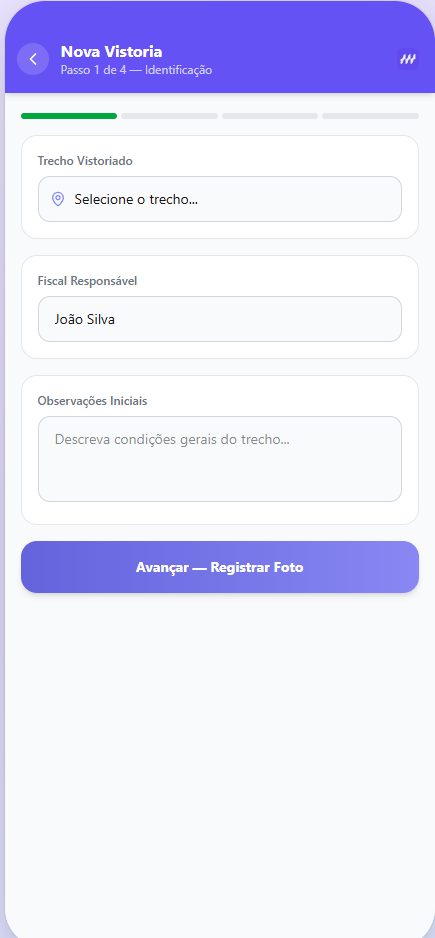

# VeroAI — Monitoramento Inteligente de Vegetação em Rodovias

> **Challenge CCR Motiva · Sprint 1 — Exploração, Requisitos e Protótipo**

---

## Contexto Regulatório

A conservação de rodovias concedidas no Brasil é regulada pela **ARTESP** (Agência de Transporte do Estado de São Paulo) e pela **ANTT** (Agência Nacional de Transportes Terrestres), que estabelecem padrões mínimos de manutenção das faixas de domínio, incluindo o controle da vegetação. Entre as exigências, destaca-se o limite de altura da vegetação nas margens das pistas: quando ultrapassa **30 cm**, a concessionária está sujeita a notificações, penalidades contratuais e multas administrativas.

A **Motiva**, concessionária do grupo CCR responsável pela operação de rodovias no Estado de São Paulo, mantém equipes de conservação distribuídas em regionais ao longo dos corredores concedidos. Essas equipes são compostas por **fiscais de campo**, **supervisores regionais** e **gestores operacionais**, cada um com responsabilidades distintas no ciclo de monitoramento, registro e intervenção sobre a vegetação.

O fluxo operacional atual envolve inspeções periódicas realizadas manualmente, com registros em planilhas e comunicação via rádio ou mensagem, sem padronização digital do processo. Essa lacuna tecnológica compromete a rastreabilidade das vistorias, dificulta a priorização de intervenções e expõe a Motiva a riscos regulatórios evitáveis.

---

## Descrição do Problema

O monitoramento da vegetação ao longo das rodovias concedidas à Motiva/CCR depende de inspeções visuais manuais, planilhas descentralizadas, cronogramas fixos e avaliações subjetivas dos fiscais de campo. Esse modelo gera falta de padronização nos registros, risco de cortes desnecessários ou tardios, atrasos em intervenções preventivas e exposição a autuações regulatórias pela ARTESP e ANTT quando a vegetação ultrapassa o limite de 30 cm estabelecido nos contratos de concessão.

---

## Integrantes

| Nome | RM |
|------|----|
| *(André Nobrega)* | *(RM561754)* |
| *(André Gouveia)* | *(RM564219)* |
| *(Caio Carminato)* | *(RM563630)* |
| *(Guilherme Tamai )* | *(RM563276)* |
| *(Mirella Mascarenhas)* | *(RM562092)* |
| *(Vitor Komura)* | *(RM563694)* |

---

## Persona Principal

**João Silva — Fiscal de Conservação Rodoviária**

Fiscal da Motiva com 8 anos de experiência, responsável por vistoriar trechos da SP-280 na Regional Oeste. Realiza entre 3 e 6 inspeções diárias a pé ou de veículo, registrando manualmente as condições da vegetação. Precisa de uma ferramenta ágil, confiável e padronizada para documentar ocorrências em campo com rapidez, atender às exigências de rastreabilidade da ARTESP e reportar pontos críticos ao supervisor regional sem depender de conexão estável com a internet.

---

## Proposta de Solução

O **VeroAI** é um aplicativo mobile para apoio ao monitoramento inteligente da vegetação em rodovias. O app permite que fiscais registrem vistorias por trecho, capturem e enviem fotos da vegetação com referência de estaca, insiram a altura estimada e recebam, automaticamente, a classificação de risco e a recomendação de ação correspondente — em conformidade com os critérios regulatórios da ARTESP e ANTT.

### Faixas de Classificação

| Altura | Classificação | Ação |
|--------|---------------|------|
| até 10 cm | OK | Monitoramento regular |
| 10 cm a 30 cm | Atenção | Roçada preventiva em 15 dias |
| acima de 30 cm | Crítico | Roçada imediata — risco de autuação regulatória |

---

## Stack Tecnológica

| Tecnologia | Versão | Papel |
|------------|--------|-------|
| Next.js | 16 | Framework principal (App Router) |
| React | 19 | Interface de usuário |
| TypeScript | 5 | Tipagem estática |
| Tailwind CSS | 4 | Estilização utility-first |
| Recharts | latest | Gráficos e visualizações de dados |
| Lucide React | latest | Ícones |
| Vercel | — | Hospedagem e deploy contínuo |

### Justificativa Técnica

Para a Sprint 1, optou-se por uma **aplicação web responsiva mobile-first** em vez de React Native/Expo, por três razões principais:

1. **Velocidade de prototipação:** Next.js com App Router permite criar e navegar entre telas sem necessidade de emulador, ambiente nativo ou build nativo — reduzindo drasticamente o tempo de setup e permitindo foco total na experiência do usuário.
2. **Deploy e avaliação imediatos:** A integração nativa com a Vercel gera um link público funcional em menos de dois minutos após o push no GitHub, viabilizando a entrega de um protótipo navegável real em substituição a wireframes estáticos no Figma.
3. **Base sólida para evolução:** A arquitetura de componentes React e a tipagem TypeScript adotadas nesta Sprint são diretamente reaproveitáveis na Sprint 2, seja mantendo a stack web (PWA) ou migrando para React Native com Expo — que compartilha a mesma linguagem, paradigma de componentes e ecossistema de bibliotecas.

---

## Funcionalidades Principais (Sprint 1)

- [x] Tela de login com autenticação simulada (matrícula + senha)
- [x] Dashboard com resumo de trechos críticos, gráfico de distribuição e barras de altura
- [x] Lista de trechos monitorados agrupados por dia da semana, ordenados por criticidade
- [x] Filtro e busca por código e município
- [x] Detalhe do trecho com histórico de vistorias e barra de progresso regulatório
- [x] Fluxo completo de nova vistoria em 4 passos:
  - [x] Identificação do trecho e fiscal
  - [x] Registro fotográfico simulado
  - [x] Inserção de altura com gauge visual e classificação automática
  - [x] Geração de recomendação de ação com prazo e prioridade
- [x] Relatório consolidado com gráficos de barras (Recharts) e índice de conformidade
- [x] Navegação por bottom navigation bar com indicador ativo
- [x] Layout mobile-first (max-width 430px) com frame de celular no desktop

---

## Protótipo Navegável

O protótipo foi desenvolvido como **aplicação web responsiva mobile-first**, simulando a experiência de uso de um aplicativo nativo. A escolha por um site responsivo hospedado na Vercel, em substituição ao Figma, permite ao avaliador percorrer o fluxo principal completo com interações reais — navegação entre telas, formulários funcionais, lógica de classificação automática e transições de estado — sem necessidade de instruções adicionais.

Link do app: https://sprint1-hercules.vercel.app/login

**Fluxo principal:**
`Login → Dashboard → Trechos → Detalhe → Nova Vistoria → Foto → Classificação → Recomendação → Relatório`

---

## Como Rodar Localmente

```bash
# Clonar o repositório
git clone <(https://github.com/AndreNobrega125/sprint1-hercules)>
cd veroai

# Instalar dependências
npm install

# Rodar em modo desenvolvimento
npm run dev
```

Acesse **http://localhost:3000** no navegador.

Para simular a experiência mobile, pressione `F12` no Chrome e ative o modo de dispositivo móvel (iPhone 14 Pro recomendado).

---

## Status do Projeto

| Sprint | Status | Entrega |
|--------|--------|---------|
| Sprint 1 — Exploração, Requisitos e Protótipo | Concluída | Mai/2026 |
| Sprint 2 — MVP com app no Android Studio | Planejada | Junho/2026 |

---

Fotos do nosso MVP: 

| Tela de login | Tela inicial | Tela com os trechos | Cadastro vistoria |
|---------------|--------------|---------------------|-------------------|
|  |  |  |  |

| Tela trecho com fotos | Classifica vegetação | Tela recomendação | Tela relatório |
|----------------------|----------------------|-------------------|----------------|
|  |  |  |  |

---

Projeto acadêmico desenvolvido para o **Challenge CCR Motiva — FIAP 2026**.
